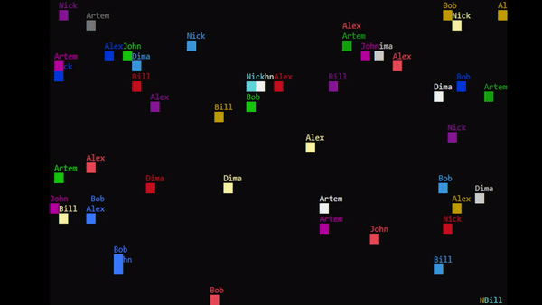
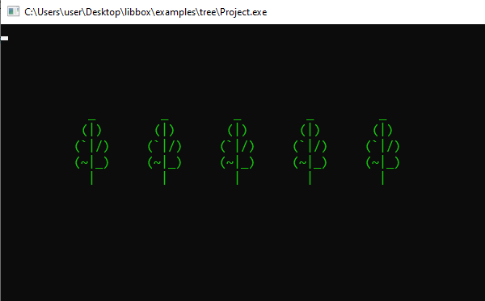
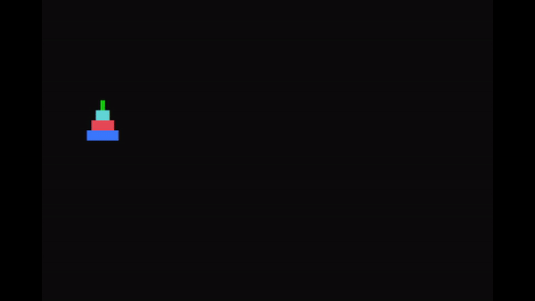
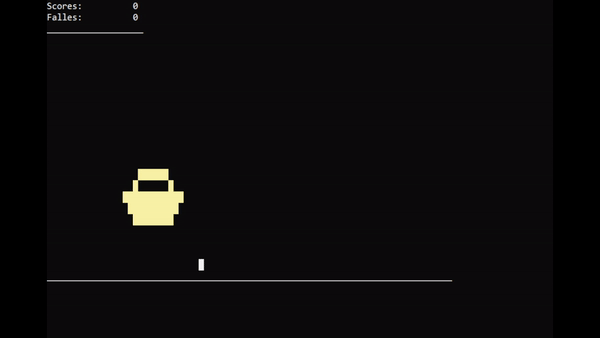
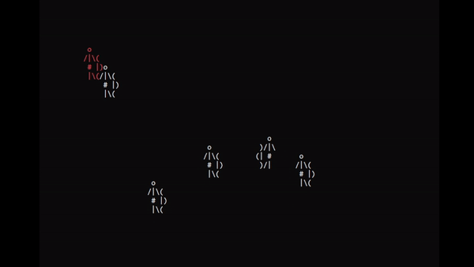
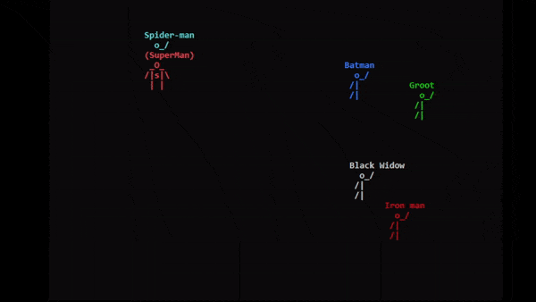

## Библиотека libbox

Эту библиотечку я написал для своих школьников и студентов, которые только начинают знакомиться с языком программирования С++. Она позволяет быстрее и проще создавать консольные программы с подвижной цветной псевдографикой.
Например, такие, как эта.



Я надеюсь, что эта библиотека будет полезна кому-то еще, кроме меня и моих учеников, поэтому постарался подробно здесь все расписать.

Библиотека libbox включает в себя 4 основные компонента:
+ `disp` - виртуальный дисплей,
+ `keyboard` - клавиатура,
+ `timer` - объект для управления временем анимации,
+ `random` - объект для генерации псевдослучайных значений.

Каждый из них содержит набор полезных методов. Такой подход позволяет школьникам наглядно и просто познакомиться с методами еще до изучения ООП. 

Например, с объектом `disp` можно работать следующим образом:
```
#include "box/box.h"

using namespace box;

int main() {
	disp.SetTextColor(CL_GREEN);
	disp.Clear();
	
	for(int i=10; i<60; i+=10) {
		disp.Move(i, 5);
		disp << "  _  " << endl;
		disp << " (|) " << endl;
		disp << "(`|/)" << endl;
		disp << "(~|_)" << endl;
		disp << "  |  " << endl;
	}
	disp.Update();
	
	keyboard.ReadKey();
}
```

Если запустить эту программу, то получим такой экран



Нетрудно догадаться, что `disp` в отличие от `cout` позволяет задавать верхний левый угол области экрана в которую происходит печать символов. В остальном он просто дублирует функционал объекта `cout` и также позволяет выводить на экран числа, символы и строки.

А последняя строчка `keyboard.ReadKey();` - это ожидание нажатия любой клавиши перед завершением программы. Кроме этого объект `keyboard` позволяет проверить состояние любой клавиши виртуальной клавиатуры Windows (использует winapi).

Основные методы объекта `keyboard` это
+ `int ReadKey()` - ожидает нажатия клавиши и возвращает ее код,
+ `bool Pressed()` - неблокирующая проверка состояния клавиатуры (возвращает true, если была нажата клавиша),
+ `bool Pressed(int vk_code)` - неблокирующая проверка была ли нажата клавиша с кодом vk_code,
+ `bool Released(int vk_code)` - неблокирующая проверка была ли отпущена клавиша с кодом vk_code,
+ `bool Down(int vk_code)` - вернет true если клавиша с кодом vk_code нажата (в нижнем положении) в данный момент,
+ `bool Up(int vk_code)` - вернет true если клавиша с кодом vk_code отпущена (в верхнем положении) в данный момент.

Здесь vk_code - это код клавиши виртуальной клавиатуры windows, например, 
+ VK_UP - стрелочка вверх,
+ VK_DOWN - стрелочка вниз и т.п.

Полный список обозначений можно [посмотреть здесь](https://learn.microsoft.com/en-gb/windows/win32/inputdev/virtual-key-codes).

Использования объекта `keyboard` демонстрирует следующая простая программа:
```
#include "box/box.h"
using namespace box;

void Draw(int x, int y) {
	disp.Move(x, y);
	disp.Replace('#', char(219));
	disp.SetTextColor(CL_GREEN);  disp << "   #   " << endl;
	disp.SetTextColor(CL_CYAN);   disp << "  ###  " << endl;
	disp.SetTextColor(CL_RED);    disp << " ##### " << endl;
	disp.SetTextColor(CL_BLUE);   disp << "#######" << endl;
}

int main() {
	int x = 10, y = 10;
	while(1) {
    	disp.Clear();
        Draw(x, y);
    	disp.Update();

        if(keyboard.Down(VK_RIGHT)) x+=2;
        if(keyboard.Down(VK_LEFT)) x-=2;
        if(keyboard.Down(VK_UP)) y-=1;
        if(keyboard.Down(VK_DOWN)) y+=1;
        if(keyboard.Down(VK_ESCAPE)) break;
    	timer.SyncLoopTo(20);
    }
}
```

Результатом ее работы является цветная пирамидка, управляемая с клавиатуры. Программа завершается при нажатии клавиши ESCAPE.



В этом примере, кроме работы с клавиатурой показана возможность выбора цветов `disp.SetTextColor(CL_GREEN);` а также замены символов в процесс вывода в виртуальных дисплей. Команда `disp.Replace('#', char(219));` включает режим замена символа '#' на символ с кодом 219, который у меня соответсвует символу '▮' - закрашенный прямоугольник.

Объект `random` имеет следующие методы:
+ `void RandomizeTimer()` - рандомизация по времени,
+ `int Int(int a, int b)` - случайное целое значение на отрезке [a; b] (равномерное распределение),
+ `float Float(float a, float b)` - случайное вещественное значение на отрезке [a; b] (равномерное распределение),
+ `T Choice(std::vector<T> options)` - выбор случайного значения из вектора вариантов (шаблонный метод).

Следующий пример демонстрирует использование объекта `random`. Эта программа "разбрасывает" названия разных языков программирования на экране случайным образом, задавая каждой строчке случайным образом выбранные цвета фона и текста.

```
#include <string>

#include "box/display.h"
#include "box/random.h"
#include "box/keyboard.h"
#include "box/timer.h"
using namespace box;

int main() {
	disp.Clear();
	keyboard.ReadKey();
	
	random.RandomizeTimer();
	for(int i=0; i<50; i++) {
		int x = random.Int(5, 40);
		int y = random.Int(5, 20);
		
		using Palette = std::pair<int, int>;
		Palette palette = random.Choice<Palette>({
			{CL_WHITE, CL_DARKRED}, 
			{CL_WHITE, CL_DARKGREEN},
			{CL_WHITE, CL_DARKBLUE}, 
			{CL_BLACK, CL_YELLOW},
			{CL_WHITE, CL_DARKMAGENTA}
		});
		disp.SetTextColor(palette.first);
		disp.SetBgColor(palette.second);
		
		std::string text = random.Choice<std::string>({
			"C++", "C", "Python", "C#", "Java",
			"Go", "Perl", "JS", "Kotlin", "Swift"
		});
		
		disp.Print(x, y, text);
		disp.Update();
		timer.Wait(100);
	}
	
	keyboard.ReadKey();
}
```

Результат работы выглядит так:


Объект `timer` имеет методы:
+ `int Elapsed() const` - количество миллисекунд, прошедших с момента создания или перезапуска таймера,
+ `void Reset()` - перезапуск таймера,
+ `void Wait(int ms)` - остановка программы на заданное количество миллисекунд,
+ `int SyncLoopTo(int ms)` - синхронизация на заданное количество миллисекунд.

Метод `int SyncLoopTo(int ms)` предназначен для получения фиксированной частоты обновления экрана в цикле анимации. Он приостанавливает выполнение программы до тех пор, пока между предыдущим и текущим его вызовом не пройдет указанное число миллисекунд. То есть в нем отсчет времени ведется от предыдущего его вызова.

Я использую эту библиотеку в процессе преподавания С++ с 2020 года и несмотря на ее простоту она оказалось довольно функциональной и очень полезной для меня как преподавателя. С ее помощью школьники без особого труда могут создавать простые, но интересные игры.



Также она помогает мне в преподавании ООП школьникам и студентам, так как позволяет наглядно показывать объекты и работу их методов без изучения более сложных графических библиотек. Один из примеров, который нравится моим студентам это игра "Лучник".



А в данном репозитарии я разместил [код примера "Супергерои"](https://github.com/zazicam/libbox/blob/main/libbox-vs/main.cpp), который я использую при объяснении основ ООП. В этом примере есть базовый класс Hero, от которого наследуются 2 класса:
+ BotHero - двигается случайным образом,
+ UserHero - управляется пользователем с клавиатуры (супермен).



Раньше своим школьникам и студентам я давал готовые проекты с уже собранной статической библиотекой под нужную им среду разработки, но сейчас я решил выложить полностью исходный код библиотеки - смотрите [в репозитарии в папке "libbix-vs/box"](https://github.com/zazicam/libbox/tree/main/libbox-vs/box).
